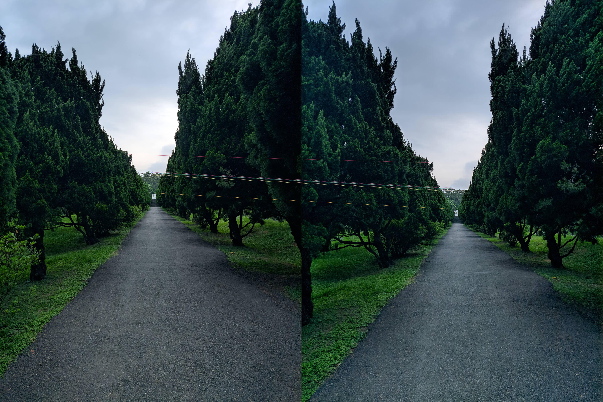

# CVFX_HW4
  # 1.sequence of moving-forward images in campus
  >>        |        | 
  >>        |
   | 
  >### 以上是我們在梅園拍的六張連續照片。
  
  # 2.feature extraction and matching results
  >## orb
  >>  
  >> 
  >>
  > 
  >### 最初我們用跟助教相同的code將圖片一二，圖片二三，圖片三四，圖片四五，圖片五六 做feature extraction，feature extractor是用orb。

  
  # 3.image alignment and generate infinite zooming effect
  
  # 4.implement different feature extrators
  >## SIFT
  >>
  >### 之後我們做了圖片五到六sift，雖然sift需要跑比較久，但是很明顯地它的效果較佳。
  >## SURF
  >>
  >### 最後圖片一到二的surf，  
  
  # 5.add some image processing to enhance effect
  >>
  >### 最後我們有加了一些特效，像是  
